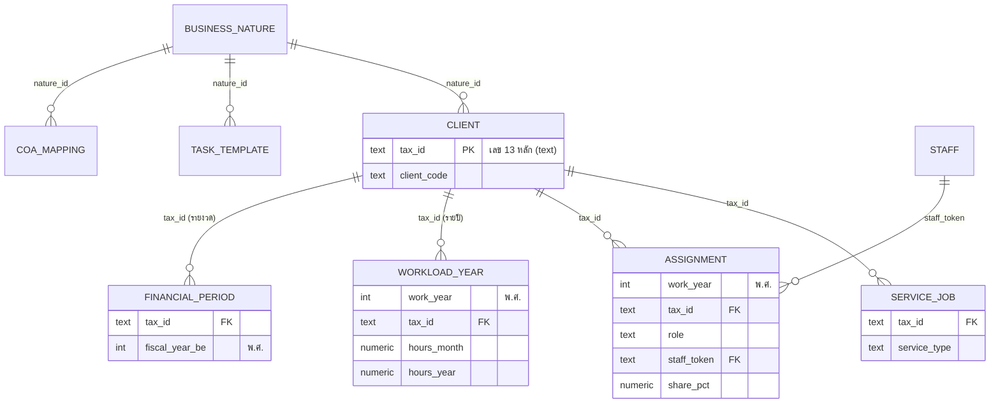

# SCHEMA_STATUS — สรุปสถานะโปรเจกต์ BBT Client Master

> จัดทำ 20 ก.ค. 2569 (พ.ศ.) | **แหล่งข้อมูลที่ใช้:** อ่านจากไฟล์ `supabase-setup/schema.sql` และ `supabase-setup/bbt_setup_all.sql` ใน repo (เข้าถึงฐานข้อมูลจริงบน Supabase โดยตรงไม่ได้ในรอบที่จัดทำ เพราะต้องล็อกอิน) — อย่างไรก็ตาม ไฟล์นี้คือสคริปต์ตัวเดียวกับที่ใช้สร้างฐานจริงเมื่อ 19 ก.ค. 2569 และได้ตรวจนับจำนวนแถวหลังสร้างตรงกันครบทุกตาราง จึงถือว่าตรงกับของจริง ยกเว้นส่วนที่ทีมแก้ผ่านหน้าเว็บหลังจากนั้น
> เอกสารนี้เป็นการ "อ่านและสรุป" เท่านั้น ไม่มีการแก้ไขฐานข้อมูลหรือโค้ดใด ๆ

## 1. ภาพรวม

- ฐานข้อมูลมี **10 ตาราง + 1 ฟังก์ชัน** (`copy_year` สำหรับสร้างข้อมูลปีใหม่จากปีก่อน)
- โปรเจกต์นี้คือ **ฐานข้อมูลลูกค้ากลางของสำนักงานบัญชี BBT** (ลูกค้า 212 ราย) พร้อม **เว็บแอป** (https://bbt-client-master.netlify.app) ให้ partner 3 คน + admin 1 คน เปิดดู/แก้ข้อมูลพร้อมกันจากทุกอุปกรณ์
- ข้อมูลหลัก: ทะเบียนลูกค้า, บริการที่รับทำ, ทีมผู้รับผิดชอบรายปี, ปริมาณงาน-ชั่วโมงรายปี — วางโครงรองรับแผนต่อยอด: เว็บประมาณการ ภ.ง.ด.51, บันทึกบัญชีอัตโนมัติตาม nature ธุรกิจ, งบการเงินด้วย AI

## 2. ตารางทั้งหมด

> **หมายเหตุเรื่อง "taxid" (สำคัญ):** ระบบนี้ **ไม่มี column ชื่อ `taxid` ตรงตัว** — ใช้ชื่อ **`tax_id`** (มีขีดล่าง) เก็บเป็น **text** ความยาว 13 หลัก มีกฎบังคับรูปแบบ (regex `^[0-9]{13}$`) เลข 0 นำหน้าไม่หาย และเป็น "กุญแจกลาง" เชื่อมเกือบทุกตาราง

### client — ทะเบียนลูกค้า (ตารางแม่, 212 แถว)
| column | ชนิด | หมายเหตุ |
|---|---|---|
| tax_id | text | **PK** — เลขทะเบียนนิติบุคคล 13 หลัก |
| client_code | text | ตัวย่อบริษัท (unique) เช่น UPC, BRD |
| name_th | text | ชื่อบริษัท |
| dbd_type | text | ประเภทธุรกิจตามหมวด DBD |
| nature_id | text | **FK → business_nature** กลุ่มธุรกิจของสำนักงาน |
| client_group | text | กลุ่มลูกค้า (Others, Constant, BC, SOLVE ฯลฯ) |
| status | text | Operate / Dormant / Closed (มีกฎบังคับค่า) |
| record_mode | text | คีย์เต็ม / Import ระบบ / ลูกค้าบันทึกเอง |
| vat_registered | text | Y / N (ตรวจกับ RD VES 19/7/2569) |
| vat_reg_date_be | text | วันจดทะเบียน VAT รูปแบบ วว/ดด/ปปปป **พ.ศ.** |
| registered_capital | numeric | ทุนจดทะเบียน (บาท) |
| income_tax_scheme | text | เช่น "ขั้นบันได (SME)", "ทั่วไป (20%)", "ภ.ง.ด.55" |
| fiscal_year_end | text | วันสิ้นรอบบัญชี เช่น "31/12", "30/06" |
| fiscal_group | text | **คำนวณอัตโนมัติ** (งบตรงรอบ/งบไม่ตรงรอบ) — ห้าม insert ตรง |
| software / software_db | text | โปรแกรมบัญชี + ฐานข้อมูล/ปีเริ่มใช้ |
| note | text | หมายเหตุ |
| updated_at | timestamptz | เวลาแก้ไขล่าสุด |

ผูกกับ tax_id: **เป็นเจ้าของ tax_id เอง (PK)** ตารางอื่นชี้มาที่นี่

### business_nature — กลุ่มธุรกิจมาตรฐาน BBT (15 แถว)
| column | ชนิด | หมายเหตุ |
|---|---|---|
| nature_id | text | **PK** เช่น MFG, TRD-WS, SVC |
| name_th | text | ชื่อกลุ่ม |
| business_score | numeric | คะแนนธุรกิจ (0–2) ใช้คิดความยาก |
| examples / accounting_notes | text | ตัวอย่างธุรกิจ / จุดสำคัญทางบัญชี-ภาษี |

ผูกกับ tax_id: **ไม่ผูกตรง** — client ชี้มาที่ nature_id

### staff — พนักงาน (20 แถว รวม pseudo 2 แถว)
| column | ชนิด | หมายเหตุ |
|---|---|---|
| staff_token | text | **PK** ตัวย่อพนักงาน เช่น SUH, MMK (มีค่าพิเศษ CLIENT=ลูกค้าทำเอง, PARTNER=partner ทำเอง) |
| employee_id | text | รหัสพนักงาน เช่น BBT004 |
| token_en / name_th / name_en / nickname | text | ชื่อเรียกต่าง ๆ |
| level | text | Partner / Manager / Senior / Junior |
| start_date / status | text | วันเริ่มงาน / สถานะ |

ผูกกับ tax_id: **ไม่ผูกตรง** — เชื่อมผ่านตาราง assignment

### service_job — บริการที่ลูกค้าแต่ละรายใช้ (637 แถว)
| column | ชนิด | หมายเหตุ |
|---|---|---|
| id | bigint | **PK** (running อัตโนมัติ) |
| tax_id | text | **FK → client** |
| service_type | text | ACC / VAT / WHT / PAY / MFS / ANN |
| service_name / frequency | text | ชื่อบริการ / ความถี่ |
| fee_month | numeric | ค่าบริการ/เดือน (**ยังว่างทั้งหมด**) |
| active | text | Y / N |

ผูกกับ tax_id: **FK ตรง** — 1 ลูกค้ามีได้หลายบริการ

### task_template — งานมาตรฐานต่อ nature+บริการ (18 แถว)
| column | ชนิด | หมายเหตุ |
|---|---|---|
| template_id | text | **PK** |
| nature_id | text | กลุ่มธุรกิจ หรือ COMMON = ทุกกลุ่ม |
| service_type / period | text | ประเภทบริการ / รายเดือน-รายปี-ครึ่งปี |
| task_name / deliverable | text | งานที่ต้องทำ / ผลลัพธ์-จุดควบคุม |

ผูกกับ tax_id: **ไม่ผูกตรง** — เว็บนำไป match กับลูกค้าผ่าน nature_id + service_type

### coa_mapping — กฎลงบัญชีอัตโนมัติ (แม่แบบ 12 แถว)
| column | ชนิด | หมายเหตุ |
|---|---|---|
| map_id | text | **PK** |
| nature_id / doc_type / transaction | text | กลุ่มธุรกิจ / ประเภทเอกสาร / รายการค้า |
| debit / credit / vat_treatment / wht | text | เดบิต / เครดิต / VAT / หัก ณ ที่จ่าย |

ผูกกับ tax_id: **ไม่ผูกตรง** — ผ่าน nature_id (ใช้ในเฟสบันทึกบัญชีอัตโนมัติ)

### assignment — ทีมผู้รับผิดชอบรายปี (866 แถว/ปี, มีปี 2569 และ 2570)
| column | ชนิด | หมายเหตุ |
|---|---|---|
| id | bigint | **PK** |
| work_year | int | ปีทำงาน **พ.ศ.** เช่น 2569 |
| tax_id | text | **FK → client** |
| role | text | Prepare / Support / Closing / Supervisor / Partner / Payroll |
| staff_token | text | **FK → staff** |
| share_pct | numeric | สัดส่วน % (แบ่งหลายคนได้ เช่น กลุ่ม BC 30/45/15/10) |
| source_note / updated_at | text/timestamptz | ที่มา / เวลาแก้ |

ผูกกับ tax_id: **FK ตรง** — unique ที่ (ปี+บริษัท+บทบาท+คน)

### workload_year — ปริมาณงานและชั่วโมงรายปี (212 แถว/ปี)
| column | ชนิด | หมายเหตุ |
|---|---|---|
| id | bigint | **PK** |
| work_year | int | ปี พ.ศ. |
| tax_id | text | **FK → client** (unique คู่กับปี) |
| v_purchase … v_total | numeric | ใบสำคัญแยกประเภท ซื้อ/ขาย/รับ/จ่าย/ทั่วไป/อื่น/รวม |
| account_count | numeric | จำนวนบัญชี |
| hp, lease, loan_bank, loan_director, lend_director, fixed_assets | text | ธงความซับซ้อน (Y/ว่าง) |
| score_volume / score_business / score_complex / score_total | numeric | คะแนนความยาก |
| difficulty | text | ง่าย / ปานกลาง / ยาก |
| hours_month / hours_close_year / hours_year / hours_month_prev | numeric | ชม./เดือน, ชม.ปิดงบ/ปี, ชม./ปี (ค่าจริง ไม่คำนวณใหม่), ชม.ปีก่อน |
| calc_reason / hours_class | text | เหตุผลการคิด / กลุ่มชั่วโมง (เกินปกติ ฯลฯ) |

ผูกกับ tax_id: **FK ตรง** — หัวใจของหน้า "ภาพรวม" ในเว็บ

### financial_period — ผลประกอบการรายงวด (มีแถวตัวอย่าง 1 แถว)
| column | ชนิด | หมายเหตุ |
|---|---|---|
| id | bigint | **PK** |
| tax_id | text | **FK → client** |
| fiscal_year_be | int | ปีงบ **พ.ศ.** |
| period | text | FULL / H1 ฯลฯ |
| revenue / expenses | numeric | รายได้ / ค่าใช้จ่าย |
| net_profit | numeric | **คำนวณอัตโนมัติ** (รายได้−ค่าใช้จ่าย) ห้าม insert ตรง |
| tax_paid / pnd51_est_profit | numeric | ภาษีที่ชำระ / ประมาณการกำไร ภ.ง.ด.51 |
| source / note | text | แหล่งข้อมูล / หมายเหตุ |

ผูกกับ tax_id: **FK ตรง** — ตารางนี้คือฐานของเว็บ ภ.ง.ด.51 ในอนาคต (ยังแทบว่าง)

### app_user — ผู้ใช้ระบบ (4 คน)
| column | ชนิด | หมายเหตุ |
|---|---|---|
| user_id | uuid | **PK, FK → auth.users** (ระบบล็อกอินของ Supabase) |
| full_name | text | ชื่อ |
| app_role | text | partner / admin |

ผูกกับ tax_id: **ไม่ผูก** — เป็นตารางสิทธิ์ผู้ใช้

## 3. แผนผังความสัมพันธ์

## 4. Feature / หน้าที่ในโค้ด + สถานะ

| Feature | ทำอะไร | สถานะ |
|---|---|---|
| ฐานข้อมูล 10 ตาราง + ข้อมูลตั้งต้น 212 บริษัท | สร้างบน Supabase (สิงคโปร์, free tier) | เสร็จ |
| เว็บแอป login (Supabase Auth) | เข้าระบบด้วยอีเมล/รหัสผ่าน | เสร็จ |
| หน้ารายบริษัท | ค้นหา/กรอง ดูข้อมูลลูกค้า แก้ทีมและชั่วโมง บันทึกลงฐานจริง | เสร็จ |
| หน้าภาพรวม แถบ "ลูกค้า" | ชม./เดือน + ชม./ปี ทุกบริษัท กรองตามกลุ่มชั่วโมง แสดง Prepare/Closing (หลายคนพร้อม %) | เสร็จ (รอลากขึ้น Netlify) |
| หน้าภาพรวม แถบ "พนักงาน" | ชม./เดือน + ชม./ปี ต่อคน + แถบภาระงานเทียบ 1,680 ชม./ปี | เสร็จ (รอลากขึ้น Netlify) |
| ปุ่มสร้างปีใหม่ (copy_year) | คัดลอกทีม+ชั่วโมงจากปีก่อน | เสร็จ (มีข้อสังเกต: การคัดลอกครั้งแรกไปปี 2570 ขาดตอน ต้องกดซ้ำ — แก้ข้อมูลแล้ว สาเหตุรากยังไม่สรุป) |
| ธีมเขียว + โลโก้ BeBigTree | ปรับหน้าตาตามแบรนด์ | เสร็จ (รอลากขึ้น Netlify) |
| แบ่งชั่วโมงกลุ่ม BC + AFCL closing 50:50 | SQL ปรับ assignment ตามหลักการ Excel | กำลังทำ (ไฟล์ `fix_group_split.sql` พร้อมแล้ว รอผู้ใช้รันใน SQL Editor) |
| เพิ่มผู้ใช้ครบ 4 คน | สร้างบัญชี partner อีก 3 คน | กำลังทำ (มีแล้ว 1 คน) |
| กรอกค่าบริการ (fee_month) และผลประกอบการ (financial_period) | เติมข้อมูลให้พร้อมใช้เฟสถัดไป | ยังไม่เริ่ม |
| เว็บประมาณการ ภ.ง.ด.51 | ใช้ financial_period + รอบบัญชี | ยังไม่เริ่ม |
| บันทึกบัญชีอัตโนมัติตาม nature | ใช้ coa_mapping (ตอนนี้เป็นแม่แบบ 12 กฎ ยังไม่ครบทุก nature) | ยังไม่เริ่ม |
| งบการเงินด้วย AI | ตามแผนใหญ่ | ยังไม่เริ่ม |

## 5. กติกาตั้งชื่อที่ใช้จริง

- ชื่อตารางและ column เป็น **snake_case ภาษาอังกฤษ ตัวพิมพ์เล็ก** (เช่น `client_code`, `hours_month`) ชื่อตารางเป็นเอกพจน์ (`client` ไม่ใช่ `clients`)
- กุญแจกลางชื่อ **`tax_id`** (text 13 หลัก) — ตารางรายปีใช้คู่ **`work_year`** (int, **พ.ศ.**)
- ปีทั้งหมดเป็น **พ.ศ.**: `work_year`, `fiscal_year_be` (ลงท้าย `_be` = Buddhist Era)
- วันที่ที่มาจากเอกสารไทยเก็บเป็น **text รูปแบบ วว/ดด/ปปปป พ.ศ.** (`vat_reg_date_be`, `fiscal_year_end` เก็บเฉพาะ วว/ดด) ส่วนเวลาแก้ไขระบบใช้ `updated_at` เป็น timestamptz
- ค่าใช่/ไม่ใช่ เก็บเป็น **text 'Y' / 'N'** (ไม่ใช่ boolean)
- ค่าประเภท (enum) หลายตัวเก็บเป็น **ข้อความภาษาไทย** ตรงตามที่ทีมใช้ เช่น record_mode = "คีย์เต็ม", difficulty = "ยาก", hours_class = "เกินปกติ"
- column ที่คำนวณอัตโนมัติ: `client.fiscal_group`, `financial_period.net_profit` (generated — insert/update ตรงไม่ได้)
- จำนวนเงิน/ชั่วโมง/คะแนน เป็น numeric ทั้งหมด

## 6. ⚠️ จุดเสี่ยงตอนรวมกับอีกฝ่าย

- **taxid เก็บเป็น text ✅ ปลอดภัยเรื่องเลข 0 นำหน้า** — แต่ชื่อ column ของเราคือ **`tax_id`** (มี underscore) ถ้าอีกฝ่ายใช้ `taxid` หรือ `tin` ต้องตกลง mapping ก่อน merge และถ้าอีกฝ่ายเก็บเป็น number ต้องเตือนให้แปลงเป็น text ฝั่งเขา (เลขไทยขึ้นต้นด้วย 0 ทุกตัว ถ้าเป็น number เลข 0 หน้าจะหายทันที)
- **ตารางที่ concept น่าจะซ้ำกับงานอีกฝ่าย:** `client` (ข้อมูลลูกค้า — ชื่อ, ทะเบียน, VAT, ทุน) มีโอกาสชนสูงสุด ต้องตกลงว่าใครเป็น master; รองลงมาคือ `staff` (ทะเบียนพนักงาน) และ `financial_period` (ถ้าอีกฝ่ายทำเรื่องงบ/ภาษีจะมีตารางคล้ายกัน)
- **column ที่อาจตีความคนละอย่าง:**
  - `vat_registered` = สถานะปัจจุบันจาก RD VES ณ 19/7/2569 ไม่ใช่ "เคยจด" — บริษัทเพิกถอนแล้วจะเป็น N
  - `hours_year` = ค่าจริงจากไฟล์วางแผน (รวมปิดงบสิ้นปี) ไม่ใช่ hours_month×12 — ห้ามคำนวณทับ
  - `hours_class` = ผลจัดกลุ่มที่คำนวณไว้ในไฟล์ Excel ครั้งเดียว ไม่ re-calculate อัตโนมัติเมื่อแก้ชั่วโมง
  - `staff_token` มีค่าพิเศษ `CLIENT` (ลูกค้าทำเอง) และ `PARTNER` (partner ทำเอง) — ไม่ใช่พนักงานจริง ระวังตอน join
  - `client_group` (กลุ่มภายใน เช่น BC, Constant) กับ `nature_id` (กลุ่มธุรกิจ) ชื่อคล้ายแต่คนละความหมาย
  - ปีเป็น พ.ศ. ทั้งหมด — ถ้าอีกฝ่ายใช้ ค.ศ. ต้องแปลงตอน merge
  - ค่า Y/N เป็น text — ถ้าอีกฝ่ายใช้ boolean true/false ต้อง map

## 7. คำถามที่ต้องเคลียร์กับอีกฝ่าย

1. ชื่อและชนิดของกุญแจร่วม: ตกลงใช้ `tax_id` (text 13 หลัก) ตรงกันไหม ฝั่งเขาเก็บแบบไหน
2. ข้อมูลลูกค้า (ชื่อ, VAT, ทุน, รอบบัญชี) ใครเป็น master — ถ้าซ้ำกันจะ sync ทางไหน
3. มาตรฐานปีและวันที่: พ.ศ. หรือ ค.ศ., text หรือ date — เลือกอย่างเดียวร่วมกัน
4. มาตรฐานค่าใช่/ไม่ใช่: 'Y'/'N' (แบบเรา) หรือ boolean
5. ทะเบียนพนักงาน/ตัวย่อ (staff_token) ใช้ชุดเดียวกันได้ไหม รวมค่าพิเศษ CLIENT/PARTNER
6. การจัดกลุ่มธุรกิจ: ฝั่งเราใช้ nature 15 กลุ่มของสำนักงาน — อีกฝ่ายใช้ TSIC/DBD ตรง ๆ หรือเปล่า ต้อง map กันไหม
7. สิทธิ์การเข้าถึงหลัง merge: ตอนนี้ทุกคนที่ล็อกอินแก้ได้ทุกตาราง — ต้องแยกสิทธิ์ admin/partner/พนักงานไหม
8. แผนตาราง `financial_period`: ถ้าอีกฝ่ายทำโมดูลงบ/ภาษีอยู่ ให้ใช้ตารางนี้ร่วมกันหรือแยกแล้วเชื่อม
